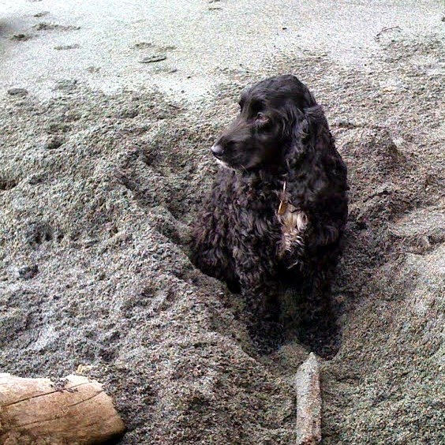

UPDATE 2020-03-11: Here are details, still perfectly good, for building my previous site using Ghost CRM.  OpenShift 2's free plan no longer exists, but Heroku, Netlify, Forestry.io and more make for great alternatives.

Here's how this site was put together.

UPDATE: Disqus "Also On" can't be hidden, so Facebook commenting has replaced it. 


##Posts
Content is written in Markdown, which is incredibly fast and easy once you get the hang of it.  There may be a little HTML tweaking, but that's all very easy to find from Google.

Markdown Cheatsheet
https://github.com/adam-p/markdown-here/wiki/Markdown-Cheatsheet

##Back End
It's running Ghost, a blogging platform built on node.js.  The hosting is on OpenShift.com, Red Hat's platform as a service.  Stats, traffic and sources are gathered and processed with Google Analytics.  Domain registration is with GoDaddy.com, famous for plentiful guides and killing things in Africa.


The backend build details for Windows, Mac OS X and Linx are available on my site.  Here's a link to the one for Windows.  

DerekRoberts.ca: Setting Up Ghost on OpenShift Using Windows
<a href="http://www.derekroberts.ca/setup-ghost-openshift-windows/" target="_blank">http://www.derekroberts.ca/setup-ghost-openshift-windows/</a>

##Theme
The appearance is from Sunflower Themes' GhostWall.

GhostWall, live Preview.
<a href="http://ghostwall.sunflowertheme.com/" target="_blank">http://ghostwall.sunflowertheme.com/</a>


GhostWall, purchase.  $24 + $2 something or other fee.  In USD.
<a href="http://themeforest.net/item/ghostwall-clean-theme-for-ghost/6071837" target="_blank">http://themeforest.net/item/ghostwall-clean-theme-for-ghost/6071837</a>

Unfortunately, to see all the changes you'd need that theme's configuration documents.  No to worry though, because there are tons of other great Ghost themes, many of which are free!  Here are a few from asking Google.

Ghost Marketplace, free themes.
<a href="http://marketplace.ghost.org/themes/free/" target="_blank">http://marketplace.ghost.org/themes/free/</a>

AllGhostThemes.com, free themes.
<a href="http://www.allghostthemes.com/tag/free/" target="_blank">http://www.allghostthemes.com/tag/free/</a>

Discover Ghost Platform Free Premium Ghost Themes
<a href="http://www.gt3themes.com/discover-ghost-platform-free-premium-ghost-themes-for-your-blog/" target="_blank">http://www.gt3themes.com/discover-ghost-platform-free-premium-ghost-themes-for-your-blog/</a>

##GhostWall Custom Config
...And if you did buy that GhostWall theme, here are the revisions that weren't included in the documentation (v1.2.1).  Comment out code like this {{! comment }}.

Set site and password/mail reset details:
- site url (both instances)
- mail (under production), provide SMTP details (I recommend mailgun.com)

```
production: {
        url: 'http://www.<---REMOVED--->.ca',
        mail: {
		transport: 'SMTP',
		options: {
			service: 'Gmail',
			auth: {
				user: '<---REMOVED--->',
				pass: '<---REMOVED--->'
			}
		}
	},
```

Add Google Analytics tracking:

- Modify default.hbs
- Paste Google-provided code between {{ ghost_head }} and < /head >

Custom Favicon to Use Blog Logo:

- edit /default.hbs
- after line with {{ meta_description }} enter:
 - < link rel="shortcut icon" href="{{ @blog.logo }}" / >

Custom Favicon from Images Folder:
(stoped using this, switched to blog logo version)

- added as /assets/images/favico.jpg
- edit default.hbs
- after line with {{ meta_description }} enter:
 - < link rel="shortcut icon" href="/assets/img/favico.png" />

Change body background colour:

- edit /assets/css/screen.css 
- in body{...} change background from #F5F5F5 to #373737
- create /assets/css/colors/soft-green-custom.css:
 - modified to use green #8da65d
- modify /assets/css/colors.css to comment out all except:
@import url(colors/soft-green-custom.css);*/

Change title:

- modify /partials/intro.hbs
- shorten < h1 >Welcome to {{ @blog.title }}< /h1 > to  < h1 >{{ @blog.title }}< /h1 >

Remove annoying excerpts from posts:

- modify /post.hbs and /page.hbs by commenting out excerpts
- change {{ excerpt }} to {{! excerpt }}
- modify /post.hbs, since this creates an alignment issue
 - change < span class="share" >, just above "Share this post:"
 - to < span class="share" style="margin-top: 21px;" >

Add custom social icons:

- add this to /assets/css/screen.css
- at end of "2. SOCIAL NETWORK ICONS" before /* End of custom icons */

```
ul.social li.thisismyjam:hover{
	background-color:#ffff00;
	border-color:#ffff00;
}
```

Set Social Icons:

- Do this like in GhostWall's guide, except you can now use our custom icons
- edit /partials/header.hbs, here's an example

```
<li class="thisismyjam">
	<a href="https://www.thisismyjam.com/Drek" target="_blank" title="My Jam!">
    	<i class="fa fa-music"></i>
	</a>
</li>
```

Static pages in header:

- edit, comment out from /partials/nav.hbs
- removed Home and Get In Touch, replaced About Us

Olark Chat:

- edit footer.hbs to run the Olark chat widget
- add this code to the bottom, before </ footer >

```
{{> widget-userlike-chat}} 
```

- in /partials/ create create widget-olark-chat.hbs (our Olark chat widget)
- use the following code, but get your JavaScript snippet from Olark.com

```
<div class="widget" id="widget-olark-chat">
	<div class="widget-content">
	
    <---Olark Code Removed--->

	</div>
</div>
```

Swap background colours:

- edit /assets/css/bootstrap.min.css
- replace all #f5f5f5 by #777777

Remove Flickr Stream and Text Widget from Sidebar:

- edit /partials/sidebars.hbs
- comment out widget-flickr and widget-text
 - change {{> to {{!>

~~Update Disqus comment config:~~

- ~~replace /partials/disqus-comment-config.hbs~~
- ~~contents:~~

```
<script>
	var disqusPublicKey = "---REMOVED---";
	var disqusShortname = "---REMOVED---";
</script>
```

Facebook comment config:

- get your code from Facebook's <a href="https://developers.facebook.com/docs/plugins/comments" target="_blank">comments plugin page</a>
- edit /partials/facebook-comment-config.hbs
 - replace the contents with FB's JavaScript SDK code
- edit /partials/comment-config.hbs
 - make sure only facebook-comment-config is uncommented
 - uncommented {{> vs commented {{!>

Remove empty navigation pull-down on mobile:

- modify header.hbs
- comment out "navbar-toggle" button, identified by class

