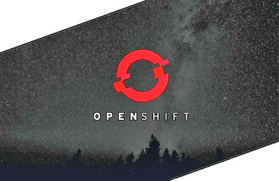

Using OS X 10.9.1.
 Insert your own values for `**CAPITALS**`.

 
###Initial Setup###

- Sign up with [OpenShift.com](http://openshift.com).
- Install [Xcode](https://developer.apple.com/xcode/).
- Install [Git for OS X](http://sourceforge.net/projects/git-osx-installer/). 
- [Note] Press Ctrl+Click to open installers rejected by OS X 10.9 (Mavericks). This happens for anything outside their App Store and approved developer list. It can be disabled from System Preferences > Security & Privacy.

- Install RHC using RubyGem using Terminal. There will be a prompt for admin access, then wait a minute.

  <pre><code>sudo gem install rhc
  </code></pre>

- Setup RHC. Enter the OpenShift login from earlier, accept the defaults and pick a unique RHC namespace.

  <pre><code>rhc setup
  </code></pre>

- Open Xcode, accept the terms of service, then quit. (Accepting from the terminal (w/ 'sudo git') failed for me, but YMMV.)

- Set some git defaults.

  <pre><code>git config --global user.email "**EMAIL@ADDRESS.com**"
  git config --global user.name "**YOUR_NAME**"
  git config --global push.default simple
  </code></pre>

- Verify Ruby and Git have installed properly.

  <pre><code>ruby -e 'puts "Welcome to Ruby"'
  git --version
  </code></pre>

- Remember to update RHC from time to time

  <pre><code>gem update rhc
  </code></pre>

- Create the Ghost application. Pick a meaningful name.
  <pre><code>rhc app create **APP_NAME** nodejs-0.10 --env NODE_ENV=production --from-code https://github.com/openshift-quickstart/openshift-ghost-quickstart.git
  </code></pre>

 
###Troubleshooting the Setup###

- The first time this is done the authenticity of your site likely can't be established, so just type 'yes' when prompted. If setup get stuck after this, press Ctrl+C and clone the git repository manually.

  <pre><code>rhc git-clone **APP_NAME**</code></pre>

- If you don't make it that far or want to start fresh, delete the application and free up that app name.

<pre><code>rhc app-delete **APP_NAME** --confirm</code></pre>

 
###Working with Git and RHC###

- Navigate into the new directory. Edit the files there manually.

<pre><code>cd **APP_NAME**</code></pre>

- To see info about your app type the following.

  <pre><code>rhc show-app **APP_NAME**
  </code></pre>

- Update and push out changes like this.

  <pre><code>git add --all .
  git commit -m 'My changes'
  git push
  </code></pre>

- Then restart the app to put those changes into effect.

  <pre><code>rhc app restart
  </code></pre>

- Don't forget to take regular snapshots!
  <pre><code>rhc save-snapshot
  </code></pre>

 
###Themes###

- Download and copy themes into \*\*APP_FOLDER\*\*/content/themes. \* Apply changes by updating git and restarting the gear.
  - Downloads are available from these sites. Most are paid.
     https://ghost.org/forum/themes/
     http://themeforest.net/category/blogging/ghost-themes

 
###Configuring Ghost###

- Login to your new blog from the following link.
   http://\*\*APP\_NAME\*\*-\*\*OPENSHIFT\_NAME\*\*.rhcloud.com/ghost
  - Create an administrator account on the first login. If something goes wrong restart the app and try again.
  - The rest is fairly straightfordward, so you can take it from here.

 

- [OPTIONAL] Provide a Gmail account for sending password resets.
  _ Edit config.js, but be warned this is not secure!
  _ After this is done update git and restart the app.
  <pre><code>        url: 'http://**YOUR_SITE_ADDRESS**,
          mail: {
                  transport: 'SMTP',
                  options: {
                          service: 'Gmail',
                          auth: {
                                  user: '**GMAIL@GMAIL.COM',
                                  pass: '**PASSWORD**'
                          }
                  }
          },
  </code></pre>

 
###Custom Domain Setup###

- Visit your application settings on OpenShift and click 'change.'
- Use the guide to changing Internet domain registrar's cname records.
  [https://openshift.redhat.com/app/console/applications](https://openshift.redhat.com/app/console/applications)

###Configuring GhostWall Theme###

For details on this this site is configured, please see the link below. Be warned that the theme used costs around \$24 US.

http://www.derekroberts.ca/build/

---

That's it!

---

- [BONUS] To make running multiple commands simpler I recommend adding aliases to .bashrc, hidden in your home directory. 
  [Creating Aliases with .bashrc](http://www.derekroberts.ca/creating-aliases-with-bashrc/)

---

Many thanks to [Andrew Hobden](http://www.hoverbear.org) (aka. Hoverbear) for providing just enough taunting/direction to help.
