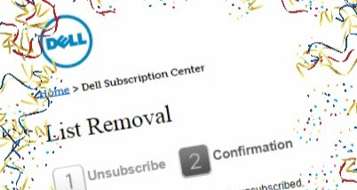

Dell's snail mail just kept showing up and, unlike email, it wasn't obvious how to stop that. Here's how to unsubscribe from:

- Email
- Postal Mail
- Phone Calls
- Faxes (seriously?!?)
- Text Messages

Just fill out <a href="https://ecomm.dell.com/GSC/ListRemoval/" target="_blank">Dell's List Removal form</a>!

**NUISANCE WARNING**: Select your country first, because when that field is changed their crappy form empties out.
