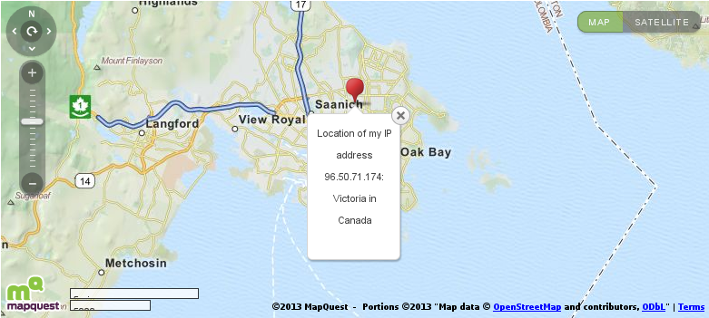

 Think you have privacy online?  You only do to an extent.  Here's how browser fingerprinting can uniquely identify you and IP lookups can provide a starting point for personal identification.  If this sounds terrifying, then I suggest a VPN.  This is (the interesting) part of an assignment I wrote in Introduction to Web Analytics, from the University of British Columbia's online Award of Digital Achievement, with content from the Digital Analytics Association.

 

Is Privacy an Option?

Before deciding whether or not to give up one’s privacy it would be best to start with an agreement of how we define privacy.  According to Wikipedia “Internet privacy involves the right or mandate of personal privacy concerning the storing, repurposing, provision to third-parties, and displaying of information pertaining to oneself via the Internet<a href="#ftnt1" name="ftnt_ref1">[1]</a>.”  It can be broken down further into Personally Identifying Information (PII) and non-Personally Identifying Information<a href="#ftnt2" name="ftnt_ref2">[2]</a> (non-PII).  Having complete privacy online is impossible, since most every page view, query and discernible action is logged somewhere.  So should we limit the debate over privacy to PII alone?  How about narrowing our scope to cookies?  Would it just be third-party or does this include first-party?  I plan to show that excluding all cookies is still not enough to maintain total privacy, which isn’t realistically an option.  The relevant questions are how much control we have over our information and whether we give our consent to its use.

        Even the most routine visit to a website exposes basic information about you.  Using the Electronic Frontier Foundation’s Panopticlick<a href="#ftnt3" name="ftnt_ref3">[3]</a> tool shows the most baseline information provided by my browser, such as user agent, HTTP accept headers, browser plugins, time zone, screen size, colour depth, system fonts, cookie status and supercookie testing.  The EFF states that my browser can be uniquely identified from the 3,651,749 tested so far.  I visit the site a second time using Private Browsing Mode<a href="#ftnt4" name="ftnt_ref4">[4]</a> and see the same results.  That means that even without allowing a single cookie between these sessions I have still been uniquely identified.  According to the EFF, even as systems are updated and their information changed, the returning browser can still be identified with a 99.1%<a href="#ftnt5" name="ftnt_ref5">[5]</a> rate of accuracy.  The false positive rate is reported at only 0.86%.  This technique is called Fingerprinting and with it we are uniquely identifiable.

<table cellpadding="0" cellspacing="0" class="c17"><tbody><tr><td class="c6 c20">
Browser Characteristic
</td><td class="c15 c20">
bits of identifying information
</td><td class="c15 c20">
one in x browsers have this value
</td><td class="c12 c20">
value
</td></tr><tr><td class="c6 c14">
User Agent
</td><td class="c15 c14">
10.72
</td><td class="c15 c14">
1692.43
</td><td class="c12">
Mozilla/5.0 (X11; Ubuntu; Linux x86_64; rv:25.0) Gecko/20100101 Firefox/25.0
</td></tr><tr><td class="c6 c9">
HTTP_ACCEPT Headers
</td><td class="c15 c9">
3.8
</td><td class="c15 c9">
13.92
</td><td class="c9 c12">
text/html, */* gzip, deflate en-us
</td></tr><tr><td class="c6">
Browser Plugin Details
</td><td class="c15">
13.69
</td><td class="c15">
13232.83
</td><td class="c12">
Plugin 0: Shockwave Flash; Shockwave Flash 11.2 r202; libflashplayer.so; (Shockwave Flash; application/x-shockwave-flash; swf) (FutureSplash Player; application/futuresplash; spl). Plugin 1: Shockwave Flash; Shockwave Flash 11.2 r202; libflashplayer.so; (Shockwave Flash; application/x-shockwave-flash; swf) (FutureSplash Player; application/futuresplash; spl).
</td></tr><tr><td class="c6 c9">
Time Zone
</td><td class="c15 c9">
5.06
</td><td class="c15 c9">
33.34
</td><td class="c12 c9">
480
</td></tr><tr><td class="c6">
Screen Size and Color Depth
</td><td class="c15">
4.42
</td><td class="c15">
21.37
</td><td class="c12">
1920x1080x24
</td></tr><tr><td class="c6 c9">
System Fonts
</td><td class="c9 c15">
18.63
</td><td class="c15 c9">
405806.78
</td><td class="c12 c9">
&lt;removed, 145 fonts total&gt;
</td></tr><tr><td class="c6">
Are Cookies Enabled?
</td><td class="c15">
0.43
</td><td class="c15">
1.35
</td><td class="c12">
Yes
</td></tr><tr><td class="c6 c9">
Limited supercookie test
</td><td class="c15 c9">
0.95
</td><td class="c15 c9">
1.93
</td><td class="c12 c9">
DOM localStorage: Yes, DOM sessionStorage: Yes, IE userData: No
</td></tr></tbody></table>
Fig. 1. Fingerprinting - What Your Browser Says About You

Given that we can be uniquely identified, can we be personally identified?  IP addresses are exposed publicly and cannot be safeguarded.  Using a tracer on my IP address shows my Internet service provider, country, province, city, GPS coordinates of the ISP’s server, level of anonymity and whether I am hiding behind a proxy.  Those GPS coordinates, 48.4710:-123.3438, are easily found using Google Maps<a href="#ftnt6" name="ftnt_ref6">[6]</a> and point to a location that is only a 2.9 kilometer, 6 minute drive from my home!  With that information I can now known to be assumed to be one of approximately 109,752 people living in Saanich, a suburb of Victoria.  I can be uniquely identified from a pool of 3,651,749 in a city of 109,752.  There are a whole host of other ways to be identified, such as legal inquiry<a href="#ftnt7" name="ftnt_ref7">[7]</a>, tracking your network card’s MAC address over wifi<a href="#ftnt8" name="ftnt_ref8">[8]</a> or through IPv6<a href="#ftnt9" name="ftnt_ref9">[9]</a> and spyware/malware<a href="#ftnt10" name="ftnt_ref10">[10]</a>.  After a point this information must become personally identifying and we haven’t even started talking about cookies.  Given enough effort, we are personally identifiable.

<table cellpadding="0" cellspacing="0" class="c17"><tbody><tr><td class="c11 c24">
96.50.71.174 IP address location &amp; more:
</td><td class="c16 c24">

</td></tr><tr><td class="c11">
My IP address [?]:
</td><td class="c16">
96.50.71.174 [Whois] [Reverse IP]
</td></tr><tr><td class="c2">
My IP country code:
</td><td class="c16 c9">
CA
</td></tr><tr><td class="c11">
My IP address country:
</td><td class="c16">
Canada
</td></tr><tr><td class="c2">
My IP address state:
</td><td class="c16 c9">
British Columbia
</td></tr><tr><td class="c11">
My IP address city:
</td><td class="c16">
Victoria
</td></tr><tr><td class="c2">
My IP postcode:
</td><td class="c9 c16">
V8N
</td></tr><tr><td class="c11">
My IP address latitude:
</td><td class="c16">
48.471
</td></tr><tr><td class="c2">
My IP address longitude:
</td><td class="c16 c9">
-123.3438
</td></tr><tr><td class="c11">
My ISP [?]:
</td><td class="c16">
Shaw Communications
</td></tr><tr><td class="c2">
My Proxy:
</td><td class="c16 c9">
None / Highly Anonymous
</td></tr><tr><td class="c11">
Organization:
</td><td class="c16">
Shaw Communications
</td></tr><tr><td class="c2">
Local time in Canada:
</td><td class="c16 c9">
12/3/2013 20:09:00
</td></tr></tbody></table>
Fig. 2. IP Tracing - What Your IP Address Says About You

On the other hand, you may not even need to be personally identified to have your privacy violated<a href="#ftnt11" name="ftnt_ref11">[11]</a>.  In the example made at Don’t Track Us, an anonymous user performs a search using terms that suggest an embarrassing health condition.  When results are presented and a link followed, these search terms are shared with the recipient domain.  This information is then passed on to and sold between third-party sites.  This is where cookies finally come in to play and are used by third parties to show embarrassing and revealing ads relating to this condition on a whole host of seemingly unrelated sites.  Potentially this data could be sold so that the user will pay higher prices for related services, such as health insurance.

<a href="#ftnt_ref1" name="ftnt1">[1]</a> Internet privacy, <a class="c0" href="http://en.wikipedia.org/wiki/Online_privacy">http://en.wikipedia.org/wiki/Online\_privacy</a>

<a href="#ftnt_ref2" name="ftnt2">[2]</a> Personally identifiable information, <a class="c0" href="http://en.wikipedia.org/wiki/Personally_identifiable_information">http://en.wikipedia.org/wiki/Personally_identifiable_information</a> 

<a href="#ftnt_ref3" name="ftnt3">[3]</a> Panopticlick: How Unique - and Trackable - Is Your Browser?, <a class="c0" href="https://panopticlick.eff.org">https://panopticlick.eff.org</a> 

<a href="#ftnt_ref4" name="ftnt4">[4]</a> Private Browsing - Browse the web without saving information about the sites you visit, <a class="c0" href="https://support.mozilla.org/en-US/kb/private-browsing-browse-web-without-saving-info">https://support.mozilla.org/en-US/kb/private-browsing-browse-web-without-saving-info</a> 

<a href="#ftnt_ref5" name="ftnt5">[5]</a> How Unique is Your Web Browser?, <a class="c0" href="https://panopticlick.eff.org/browser-uniqueness.pdf">https://panopticlick.eff.org/browser-uniqueness.pdf</a> 

<a href="#ftnt_ref6" name="ftnt6">[6]</a> Google Maps, <a class="c0" href="https://maps.google.ca/maps?q=48.4710,-123.3438&amp;hl=en&amp;sll=54.112352,-126.555646&amp;sspn=24.12625,25.268555&amp;t=m&amp;z=16">https://maps.google.ca/maps?q=48.4710,-123.3438&amp;hl=en&amp;sll=54.112352,-126.555646&amp;sspn=24.12625,25.268555&amp;t=m&amp;z=16</a> 

<a href="#ftnt_ref7" name="ftnt7">[7]</a> The Debate About Warrantless Access to ISP Customer Information <a class="c0" href="http://www.slaw.ca/2009/10/09/the-debate-about-warrantless-access-to-isp-customer-information/">http://www.slaw.ca/2009/10/09/the-debate-about-warrantless-access-to-isp-customer-information/</a> 

<a href="#ftnt_ref8" name="ftnt8">[8]</a> What does a MAC address tell you?, <a class="c0" href="http://www.identityblog.com/?p=1131">http://www.identityblog.com/?p=1131</a> 

<a href="#ftnt_ref9" name="ftnt9">[9]</a> Computer IPv6 addresses &amp; privacy, <a class="c0" href="http://www.hacker10.com/tag/ipv6-shows-mac-address/">http://www.hacker10.com/tag/ipv6-shows-mac-address/</a> 

<a href="#ftnt_ref10" name="ftnt10">[10]</a> Spyware, <a class="c0" href="http://en.wikipedia.org/wiki/Spyware">http://en.wikipedia.org/wiki/Spyware</a> 

<a href="#ftnt_ref11" name="ftnt11">[11]</a> Don’t Track Us, <a class="c0" href="http://donttrack.us/">http://donttrack.us/</a>

</body></html>

