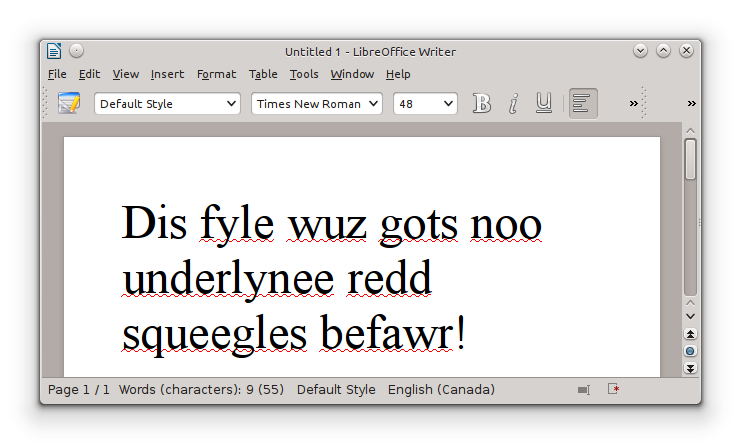

Kubuntu 13.10 x64.

I've found that LibreOffice often claims to be spellchecking, but comes up empty for Canadian, British and Australian English. That's usually because no spellchecker is actually installed. Install one of these for your language.

- hunspell
- aspell
- myspell

Here's how to install Canadian English in \*Ubuntu.

<pre><code>sudo apt-get install hunspell-en-ca
</code></pre>

Close/reopen LibreOffice and that's it! :D
