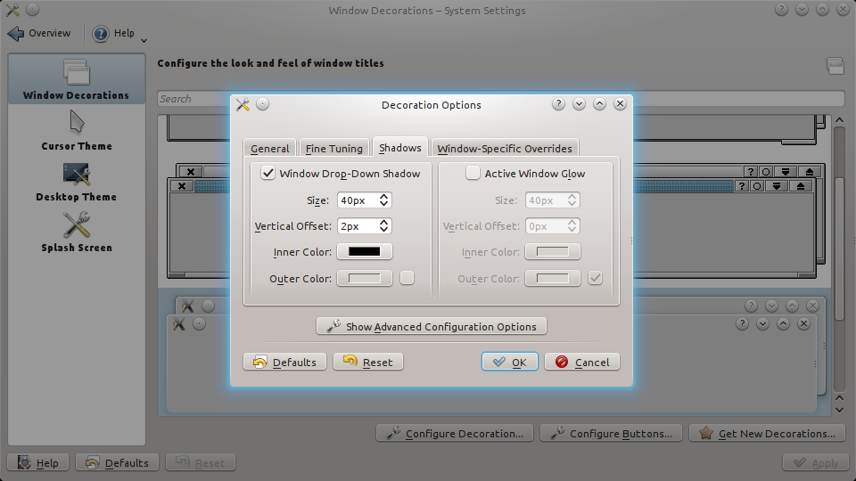
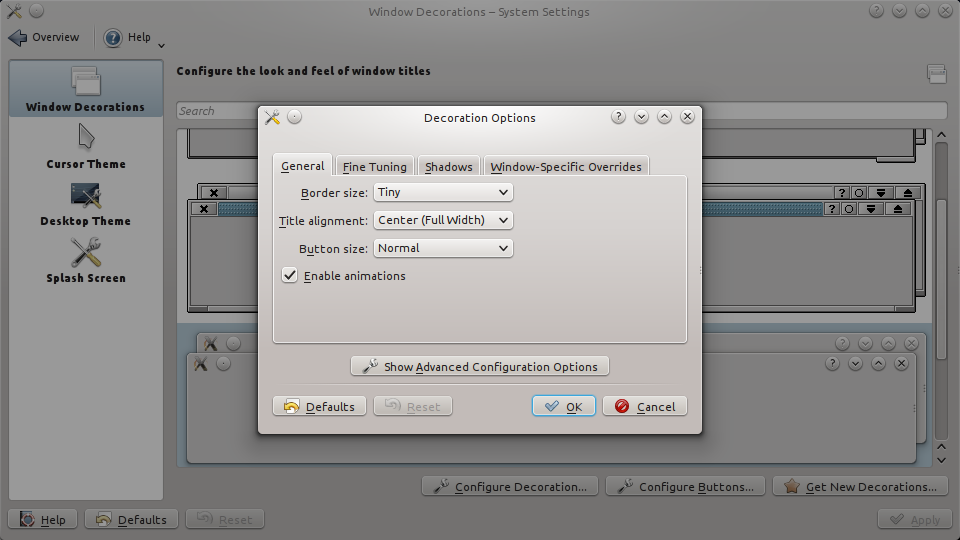

I can't stand KDE's default blue glow. Here's how to disable it. I'm using Oxygen for window decorations, but the procedure should be the same for everything else.

System: Kubuntu 13.10 x64, KDE: 4.11.2

* Start/K Logo > System Settings
* Workstation Appearance, under Workstation Appearance and Behaviour
* Window Decorations > Configure Decoration
	* The decoration in use is highlighted
* Shadows (tab)
* Active Window Glow (uncheck)
* OK and close out of any remaining windows

And here is the same window without the glow!

